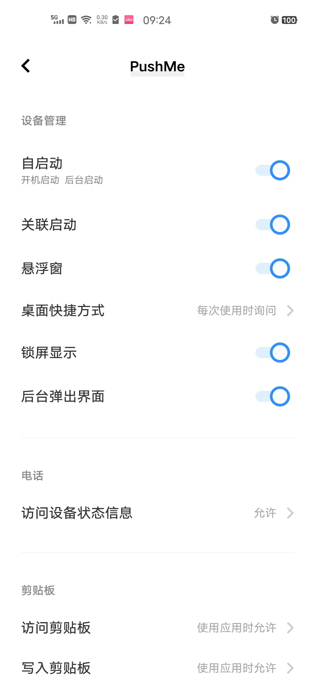

# PushMe
> PushMe，一个简单轻量的Android消息通知客户端！支持插件，支持自部署服务。

## 接口参数

请到官网查看：[https://push.i-i.me/](https://push.i-i.me/)

关注频道动态：[https://t.me/pushme_channel](https://t.me/pushme_channel)

## 下载安装

系统要求：Android7+

下载地址：[Github](https://github.com/yafoo/pushme/releases/latest) 或 [Gitee](https://gitee.com/yafu/pushme/releases/latest)

## 手机设置

因为各安卓系统杀后台严重，所以尽量给与app最大权限：

1. 权限管理：允许自启动、后台运行
2. 电池耗电管理：允许后台高耗电（实际测试，并不高耗电，见下图）
3. 通知管理：允许消息通知
4. Android12用户，需开启APP的alerm闹钟权限
5. 部分手机如果无法保持后台，请在多任务页面锁定应用试试
6. 部分手机需要关闭后台网络优化，否则会被切断后台网路连接

> 以上三项设置后，可在多任务页面把APP划掉，只留服务在后台运行。建议把通知设置里StateChannel也打开，方便查看服务是否在线，如果想关闭通道通知，可以在PushMe左上角设置里关闭。

### OriginOS 3
经实测，Vivo OriginOS3系统，睡眠模式下，会造成后台被杀，如果想保持24小时在线，需关闭睡眠模式（在电池管理->更多设置->睡眠模式），经实测，关闭睡眠模式后，夜里其他应用（如微信、头条）可能会耗电。

### MIUI 14
经实测，小米MIUI14系统，需在多任务页面，长按PushMe APP锁定后台，锁定后，即可把应用划拉掉。

### HarmonyOS 2
经实测，华为HarmonyOS2，无法保证应用后台运行。

### 其他系统
其他系统未实测，欢迎提供有问题的系统案例。

## 设置案例（vivo origin os3）

|||||
-|-|-|-
|||||

## APP预览

|||||
-|-|-|-
|||||