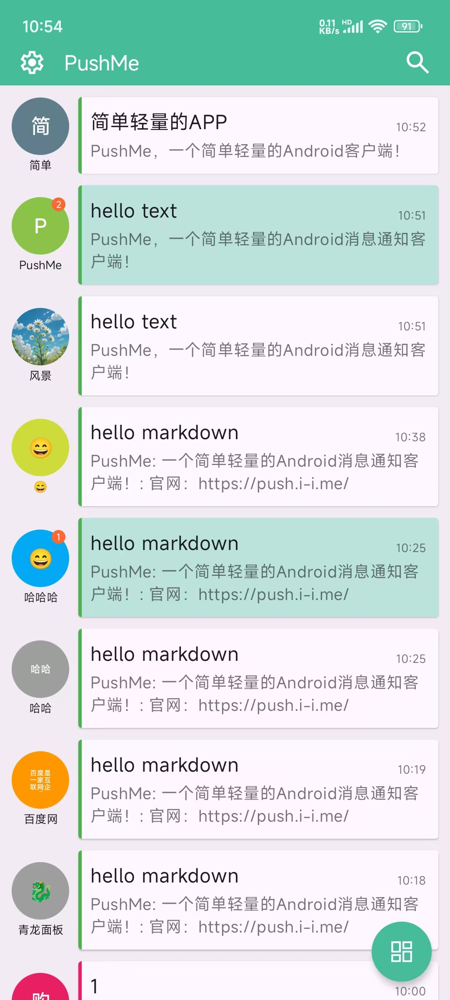
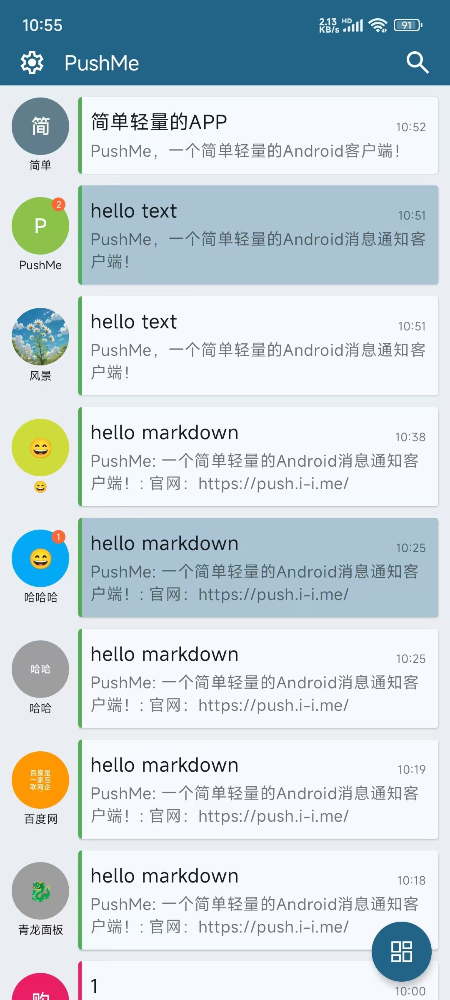
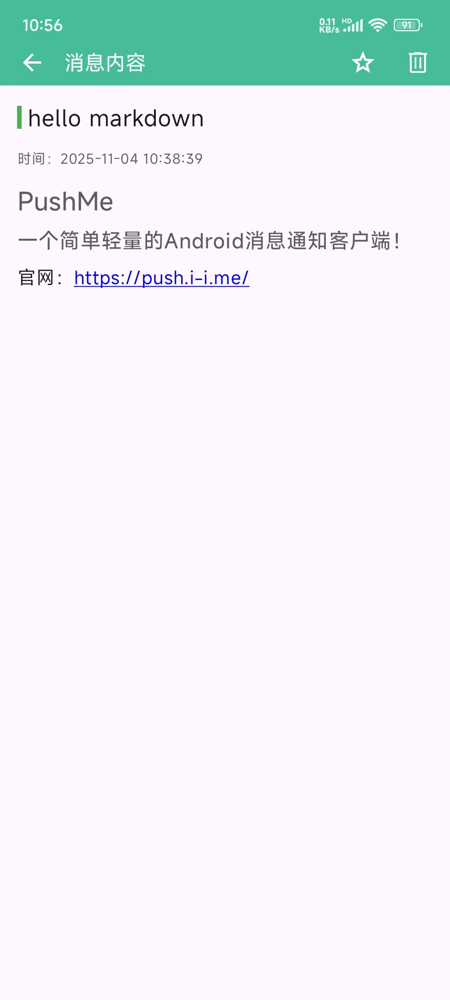
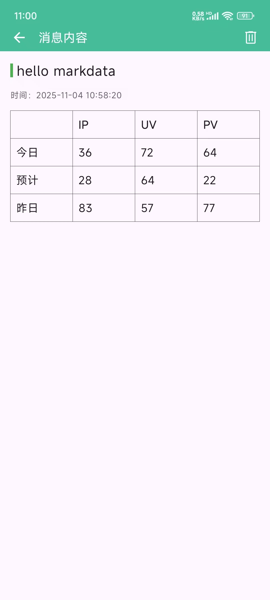
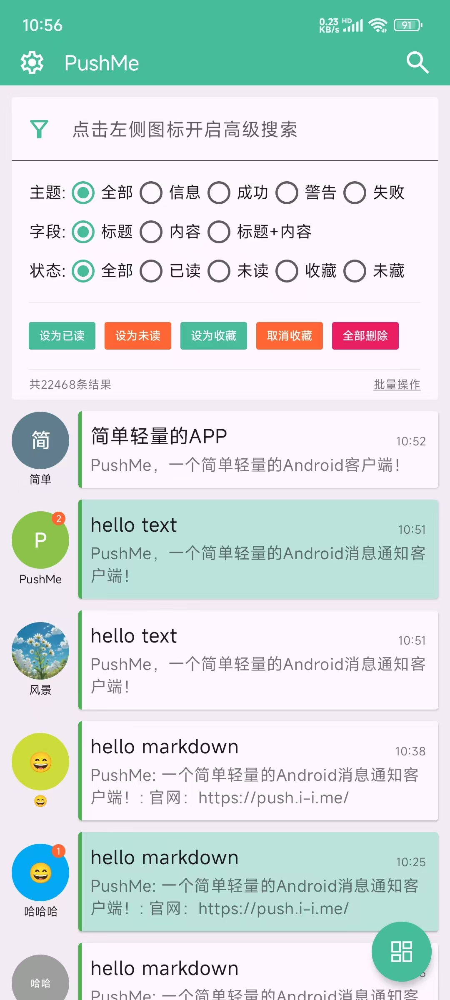
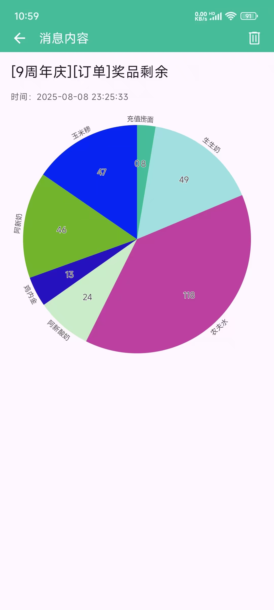
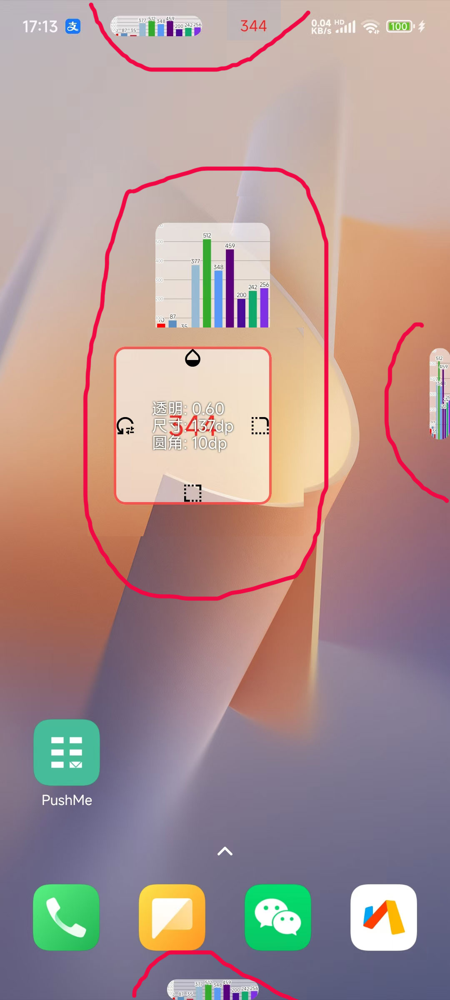
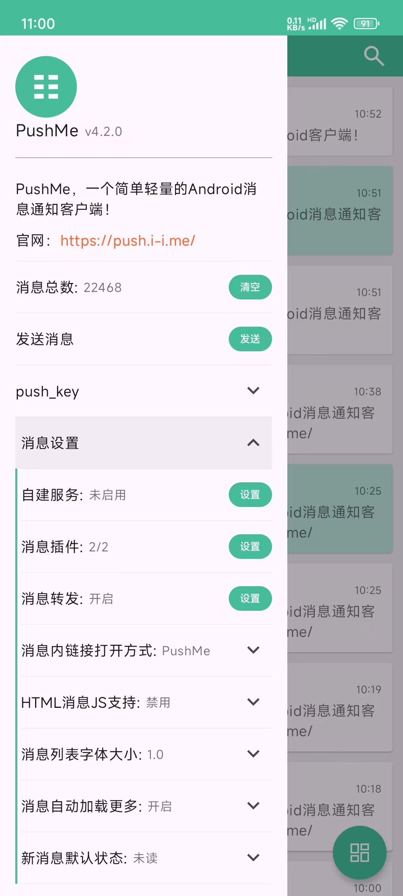
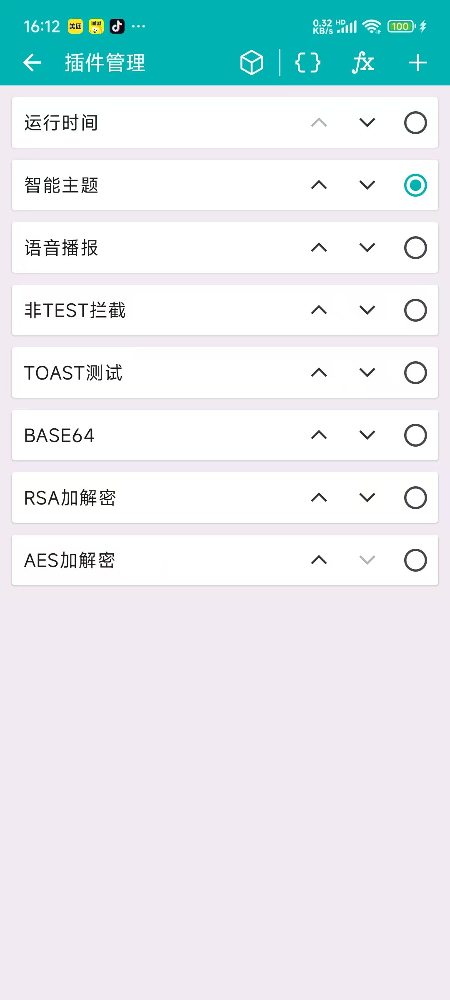
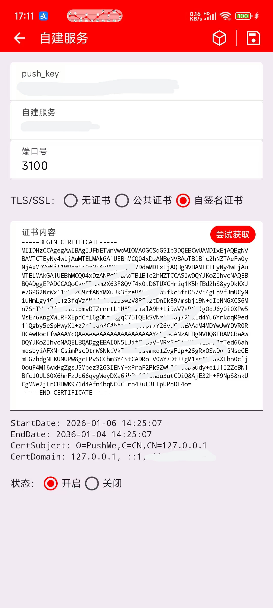

# PushMe - Android 消息通知客户端

<p align="center">
  <strong>简单 · 轻量 · 支持插件 · 可自部署</strong>
</p>

<p align="center">
  <a href="https://github.com/yafoo/pushme/releases/latest">
    
  </a>
  <a href="https://github.com/yafoo/pushme">
    
  </a>
  <a href="https://t.me/pushme_channel">
    
  </a>
</p>

---

## 📱 项目简介

PushMe 是一款专为 Android 设计的轻量级消息通知客户端，帮助你及时接收各类推送消息。

### ✨ 核心特性

- **🔌 插件功能**：支持消息插件，消息灵活二次处理
- **🏠 自部署服务**：支持私有化部署，数据完全掌控
- **⚡ 轻量高效**：资源占用低，后台运行稳定
- **📲 广泛兼容**：支持 Android 7.0 及以上版本
- **🔔 状态监控**：提供 StateChannel 通道，实时查看服务在线状态

---

## 🖼️ 应用预览

<table>
  <tr>
    <td></td>
    <td></td>
    <td></td>
    <td></td>
  </tr>
  <tr>
    <td></td>
    <td></td>
    <td></td>
    <td></td>
  </tr>
  <tr>
    <td></td>
    <td></td>
    <td></td>
    <td></td>
  </tr>
</table>

---

## 📥 下载安装

### 系统要求

- **Android 版本**：7.0 及以上

### 下载渠道

| 平台 | 下载地址 |
|------|----------|
| GitHub | [点击下载最新版本](https://github.com/yafoo/pushme/releases/latest) |
| Gitee（国内） | [点击下载最新版本](https://gitee.com/yafu/pushme/releases/latest) |

---

## 🔧 接口文档

详细的 API 接口参数说明，请访问官方网站：

👉 [https://push.i-i.me/](https://push.i-i.me/)

---

## ⚙️ 手机权限设置指南

> ⚠️ **重要提示**：由于 Android 系统对后台应用的严格管理，为确保消息能及时送达，请按照以下步骤配置应用权限。

### 快速设置

在 PushMe 应用中，进入 **`权限设置`** 页面，可快速跳转至相关设置项。

### 详细配置步骤

#### 1️⃣ 基础权限配置

- ✅ **自启动权限**：允许应用开机自启
- ✅ **后台运行权限**：允许应用在后台持续运行
- ✅ **通知权限**：允许发送和显示通知
- ✅ **电池优化豁免**：设置为"允许后台高耗电"（实际功耗很低）

#### 2️⃣ 系统特定配置

##### Android 12 用户
- 🔔 必须开启 **闹钟（Alarm）权限**

##### 多任务锁定（推荐）
- 📌 在多任务页面长按 PushMe，选择"锁定"或点击锁图标
- 锁定后可安全清理其他后台应用

##### 网络优化设置
- 🌐 部分机型需关闭"后台网络优化"或"智能网络加速"
- 防止系统在息屏后切断网络连接

---

## 📱 各品牌系统适配说明

### 🟢 Vivo - OriginOS 3

**问题**：睡眠模式会导致后台被杀

**解决方案**：
```
设置 → 电池管理 → 更多设置 → 睡眠模式 → 关闭
```

**注意事项**：
- ⚠️ 关闭睡眠模式后，夜间其他应用（如微信、今日头条）可能会增加耗电
- 建议权衡消息及时性与电量消耗

---

### 🟢 Xiaomi - MIUI 14

**解决方案**：
```
1. 打开多任务页面
2. 长按 PushMe 应用卡片
3. 点击"锁定"按钮（锁图标）
4. 锁定后即可正常清理其他应用
```

---

### 🔴 Huawei - HarmonyOS 2

**现状**：经实测，HarmonyOS 2 无法保证应用稳定后台运行

**建议**：
- 尝试上述所有权限设置
- 如仍无法解决，可能需要考虑升级系统或使用其他设备

---

### 📋 其他系统

其他品牌系统暂未进行详细测试，欢迎反馈遇到的问题。

**通用建议**：
1. 给予应用最大权限（自启动、后台运行、通知）
2. 关闭电池优化
3. 在多任务页面锁定应用
4. 关闭后台网络优化

---

## 💡 使用技巧

### 保持服务在线的最佳实践

1. **完成上述权限设置**
2. **开启 StateChannel 通知**
   - 位置：PushMe 左上角设置菜单
   - 作用：实时监控服务连接状态
   - 如不需要可在设置中关闭

3. **清理后台时的正确操作**
   - 完成权限设置和多任务锁定后
   - 可以安全地从多任务页面划掉 PushMe
   - 服务会继续在后台运行

---

## 📞 获取帮助

### 官方渠道

- 🌐 **官方网站**：[https://push.i-i.me/](https://push.i-i.me/)
- 📢 **Telegram 频道**：[https://t.me/pushme_channel](https://t.me/pushme_channel)
- 💬 **问题反馈**：[GitHub Issues](https://github.com/yafoo/pushme/issues)

### 常见问题

**Q: 为什么收不到消息推送？**  
A: 请检查是否完成了所有权限设置，特别是电池优化和多任务锁定。

**Q: 应用耗电严重吗？**  
A: 实际测试显示功耗很低，"允许后台高耗电"只是防止系统杀进程的设置，并非真的耗电。

**Q: 可以自己部署服务端吗？**  
A: 可以，PushMe 支持私有化部署，具体方法请参考官网文档。

---

<p align="center">
  <sub>Made with ❤️ by <a href="https://github.com/yafoo">yafoo</a></sub>
</p>
